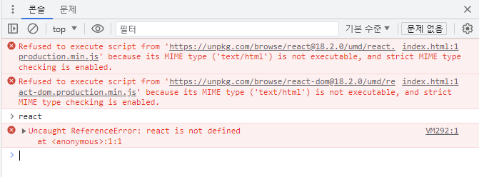

# 2.0 Introduction

[react_beginner](https://github.com/llyybbb/likelion_session/tree/main/react_study/react_beginner)

react JS는 UI를 interactive하게 만들어줌.  
js코드보다 좀 더 간단.

  
위는 이전에 하던 js 코드이다.  
버튼을 누른 횟수를 카운트하는 간단한 프로그램인데 코드가 꽤 된다.  
react는 이를 더 간단하게 할 수 있다.

  
이제 react를 사용하려는데 자꾸 에러가 난다.  
찾아보니까 무슨 보안 문제라는데 아직 해결 못했다ㅜㅜ

헉 해결했다.
링크를 엉뚱한 곳으로 연결했었다.
 <script
    crossorigin
    src="https://unpkg.com/browse/react@18.2.0/umd/react.production.min.js">   
 에서 "browse"를 지웠더니   
    
         잘 동작한다.
